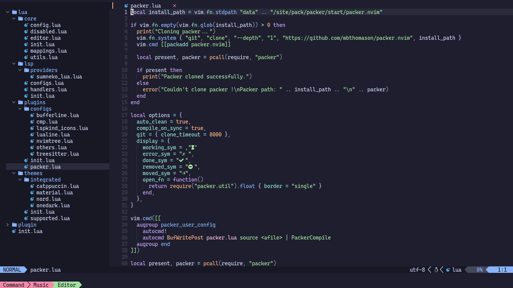

# Neovim
My custom configuration for Neovim written entirely in Lua, feel free to use it as you like and modify it.

##


# Plugins

Here are some details about the plugins used:

- Many beautiful themes: [catpuccin/nvim](https://github.com/catppuccin/nvim), [material.nvim](https://github.com/marko-cerovac/material.nvim), [nord.nvim](https://github.com/shaunsingh/nord.nvim), [onedark](https://github.com/navarasu/onedark.nvim)
- File navigation with [nvim-tree.lua](https://github.com/kyazdani42/nvim-tree.lua)
- Managing tabs, buffers with [bufferline.nvim](https://github.com/akinsho/bufferline.nvim)
- Beautiful and configurable icons with [nvim-web-devicons](https://github.com/kyazdani42/nvim-web-devicons)
- NeoVim Lsp configuration with [nvim-lspconfig](https://github.com/neovim/nvim-lspconfig) and [lsp-installer](https://github.com/williamboman/nvim-lsp-installer/)
- Autocompletion with [nvim-cmp](https://github.com/hrsh7th/nvim-cmp)
- Syntax highlighting with [nvim-treesitter](https://github.com/nvim-treesitter/nvim-treesitter)
- Autoclosing braces and html tags with [nvim-autopairs](https://github.com/windwp/nvim-autopairs)
- Indentlines with [indent-blankline.nvim](https://github.com/lukas-reineke/indent-blankline.nvim)
- Useful snippets with [friendly snippets](https://github.com/rafamadriz/friendly-snippets) + [LuaSnip](https://github.com/L3MON4D3/LuaSnip).
- A high-performance color highlighter with with [nvim-colorizer.lua](https://github.com/norcalli/nvim-colorizer.lua)
- Speed up loading Lua modules to improve startup time with [impatient.nvim](https://github.com/lewis6991/impatient.nvim)
- Lua Neovim Development with [lua-dev.nvim](https://github.com/folke/lua-dev.nvim)
- Smart and Powerful commenting with [Comment.nvim](https://github.com/numToStr/Comment.nvim)

# Configuration

It provides a file called [config.lua](https://github.com/rosmerlopez24/my-neovim/blob/main/lua/core/config.lua) which has a very basic configuration, I plan to extend it as I improve my configuration. In the meantime you can modify it and adapt it as you like.

```lua
local M = {}

-- General settings
M.config = {
  -- Theming settings
  -- Options: "catppuccin", "material", "nord", "onedark"
  theme = "catppuccin",

  -- LSP settings
  lsp = {
    -- List servers you want to installl
    -- Options: see https://github.com/williamboman/nvim-lsp-installer#available-lsps
    servers = { "sumneko_lua", "bashls", "clangd", "pyright" }
  },

  -- Treesitter settings
  -- Options: see https://github.com/nvim-treesitter/nvim-treesitter#supported-languages
  treesitter = {
    language = { "bash", "c", "cpp", "lua", "make", "python", "vim" },
  }
}

return M
```
